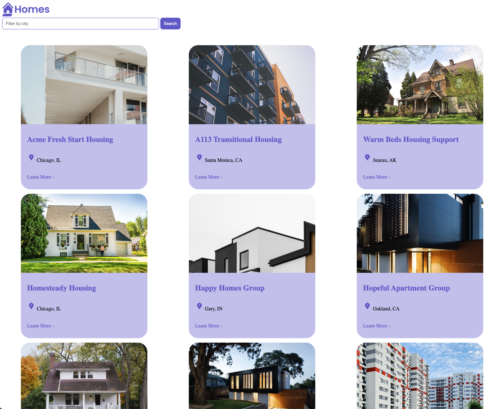

# Angular Homes App

- Angular Tutorial https://angular.dev/tutorials/first-app
 
 

 # Run the application 
 - run the mocked server
 `json-server --watch db.json`
- run the application
  `ng serve`

  # Learning Points
- Home Component (Displays housing locations and filters by city)
- Housing Location Component (Housing Location and router link to Details component)
- Details Component (More details and reactive form for sign-up)
- Housing service (fetches db.json made with json-server  and stores them as housing locations)
